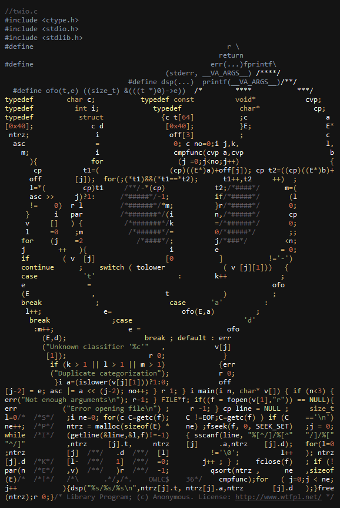

# twio.c

A theoretical library organizer program, obfuscated to resemble Twilight Sparkle from MLP:FiM.
Reads data from a text file containing book entries, and can organize each element based on author, title, or release date, in any order or combination.
Has the capability for secondary and tertiary sorting, so if two books match in their primary category exactly, they will be sorted by their secondary and tertiary category (if provided).
Outputs the data to `stdout`.

twi.c is functionally equiavalent to twio.c, but written in a human readable format without any obfuscations or excess formatting.

## Compilation
Compilation is trivial with gcc:

    gcc twio.c -o twio

All files only include the standard libraries.

## Usage
### twio.c and twi.c
    twio [text file to read from] -[a|d|t] ...
The first argument is the path to the text file to sort. The program supports up to three more arguments which indicate the way to sort the data, but only one is required. Each argument is separate and preceeded with a `-` followed by either `a`, `d`, or `t`, representing author, date, or title respectively. The first argument is the primary classification, the second the secondary, and so on. Elements are organized in ascending order by default, but can be switched to descending order by making the appropriate letter captial. For example:
 * `twio randomdata.txt -t` sorts by title in ascending order
 * `twio randomdata.txt -T` sorts by title in descending order
 * `twio randomdata.txt -a -T` sort by author in ascending order, and if authors match sort by title in descending order

### testdata_generator.c
    testdata_generator
Creates a set of data conformant to twi.c and twio.c's expected input, the file `randomdata.txt`. For testing purposes, both the author name and book title are single letters to get more overlap for secondary/tertiary sorting, but this is trivial to modify.
Both twi.c and twio.c expect the data to not be malformed, so each book entry must be formatted in the form `title/author/date\n` and each entry component cannot exceed 64 characters each.